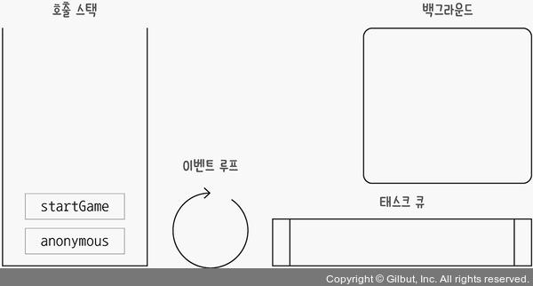

# [8주차] JavaScript ~section11

---

- 구조분해 할당
    - `배열` 혹은 `객체`에서 각각 값(value)이나 프로퍼티(property)를 분해
    → 손쉽게 별도의 변수에 담을 수 있도록 해 줌
    - 객체 내부의 속성과 할당하는 변수명이 같을 때, 코드를 줄여 쓸 수 있음
    
    ```jsx
    //ex1
    const arr = [0,1,2,3,4];
    const one = arr[0];
    const two = arr[1];
    const three = arr[2];
    const four = arr[3];
    const five = arr[4];
    
    //구조분해 할당 이용
    const [one, two, three, four, five] = arr;
    ```
    
    ```jsx
    //ex2
    const obj = {a: 1, b: 2};
    
    const a = obj.a;
    const b = obj.b;
    
    //구조분해 할당 이용
    const {a, b} = obj;
    ```
    
- 이벤트 버블링(event bubbling)
    - 한 요소에 이벤트가 발생하면 이 요소에 할당된 핸들러가 동작하고, 이어서 부모 요소의 핸들러가 동작하고 최상단의 부모 요소를 만날 때까지 반복되면서 핸들러가 동작하는 현상
    
    
    
    - 이벤트 버블링 현상이 일어나면 이벤트 리스너 콜백 함수의 event.target은 이벤트가 발생한 태그로 바뀌므로 주의해야 한다.
    - 이벤트가 발생한 태그가 아닌 이벤트를 연결한 태그에 접근하고 싶다면 event.currentTarget을 사용
    
- parentNode와 Children
    - 현재 태그의 부모 태그를 찾고 싶을 떄는 parentNode 사용
    - 자식 태그를 찾으려면 children 속성 사용
        - 자식 태그는 여러 개일 수 있으므로 children 속성은 배열 모양의 값이 된다. **단, 진짜 배열은 아니고 배열 모양의 객체이다.**
        
        ```jsx
        <table>
          <tr>
            <td id="td00"></td>
            <td id="td01">X</td>
            <td id="td02"></td>
          </tr>
        </table>
        
        //tr태그의 부모는 table 태그
        //document.querySelector('tr').parentNode;
        
        //자식 태그 찾기
        //document.querySelector('tr').children;
        // { 0: td, 1: td, 2: td }
        ```
        
- rowIndex와 cellIndex
    - tr 태그는 몇 번째 줄인지를 알려 주는 rowIndex라는 속성을 제공
    - td 태그는 몇 번째 칸인지를 알려 주는 cellIndex 라는 속성을 제공
    
    ```jsx
    const rowIndex = $tr.rowIndex;
    const cellIndex = $td.cellIndex;
    ```
    
- 유사 배열 객체와 Array.from
    - 배열 모양의 객체
    - 배열이 아니므로 배열 메서드 사용할 수 없다
        - 배열 메서드 사용하고 싶다면 Array.from 메서드로 유사 배열 객체를 배열로 바꾸기
    
    ```jsx
    Array.from($tr.children).indexOf($td);
    ```
    
- every 와 some
    - 배열에서 모든 값이 조건에 해당하는지 판단하려면 `every` 메서드를 사용하고, 하나라도 조건에 해당하는지 판단하려면 `some` 메서드를 사용
    
    ```
    
    배열.every(조건함수);
    배열.some(조건함수);
    ```
    
    - 일반 반복문을 사용하면 끝까지 탐색하지만, every와 some 메서드는 조건이 충족 또는 불충족되면 멈추므로 일반 반복문보다 효율적인 경우가 많다.
    - `every`는 하나라도 조건을 만족하지 않는 요소(조건 함수가 false를 return)를 찾으면 반복을 중단하고, `some`은 하나라도 조건을 만족하는 요소(조건 함수가 true를 return)를 찾으면 반복을 중단
    
- flat
    - flat은 배열의 차원을 한 단계 낮추는 메서드로, n차원 배열을 n-1차원 배열로 낮춘다. ex) 이차원 배열 → 일차원 배열
    - 일차원 배열은 flat을 적용해도 그대로 일차원 배열이 된다.
    
    ```jsx
    const array = [[1, 2, 3], [4, 5, 6], [7, 8, 9]];
    array.flat(); // [1, 2, 3, 4, 5, 6, 7, 8, 9]
    const array2 = [1, 2, 3, [[4, 5, 6], [7, 8, 9]]];
    array2.flat(); // [1, 2, 3, [4, 5, 6], [7, 8, 9]]
    ```
    
- window
    - window 객체는 브라우저를 가리키는 객체로, 브라우저가 제공하는 기본 객체와 함수들은 대부분 window 객체 안에 들어 있다.
    - document 객체나 console 객체도 실제로는 window.document, window.console인데, window를 생략하고 document와 console만 적는다.
    
- this
    - this는 상황에 따라 다른 값을 가지는데, 기본적으로 this는 window 객체를 가리키므로 어떤 때에 어떤 값을 가지는지 확인하기

> 1) 객체를 통해 this를 사용할 때는 this가 해당 객체를 가리키게 된다.
> 
> 
> 2) 특정 메서드는 콜백 함수의 this를 바꾼다. addEventListener가 대표적.
> 
> 3) this가 바뀌는 것을 원치 않는다면 함수 선언문 대신 화살표 함수를 사용
> 

- 참조, 깊은 복사, 얕은 복사
    - 복사는 어떤 값을 다른 변수에 대입할 때 기존 값과 참조 관계가 끊기는 것을 의미한다. 객체가 아닌 값은 애초부터 참조 관계가 없으므로 그냥 복사된다.
        - **얕은 복사**는 중첩된 객체가 있을 때 가장 바깥 객체만 복사되고 내부 객체는 참조 관계를 유지하는 복사를 의미
        - **깊은 복사**는 내부 객체까지 참조 관계가 끊겨서 복사되는 것을 의미
        
        ```jsx
        const array = [{ j: 'k' }, { l: 'm' }];
        const reference = array; // 참조
        const shallowCopy = [...array]; // 얕은 복사
        const deepCopy = JSON.parse(JSON.stringify(array)); // 깊은 복사
        console.log(array === reference); // true
        console.log(array[0] === reference[0]); // true
        console.log(array === shallowCopy); // false
        console.log(array[0] === shallowCopy[0]); // true
        console.log(array === deepCopy); // false
        console.log(array[0] === deepCopy[0]); // false
        ```
        
    - JSON.parse(JSON.stringify(값))으로 간단하게 깊은 복사가 가능하다
    - 얕은 복사 → ... 연산자를 사용
    - 배열이라면 [...배열]
    - 객체라면 {...객체}
    
- 클래스
    - 객체를 생성하는 템플릿 문법
    - class 예약어로 클래스를 선언하고 constructor 메서드 안에 기존 코드를 넣는다.
    - new를 붙여 호출하면 constructor 함수가 실행되고 객체가 반환된다. this는 생성된 객체 자신을 가리키게 된다.
    
- 클래스 상속
    - 클래스끼리 extends 예약어로 상속할 수 있다. 상속하는 클래스는 부모 클래스가 되고, 상속받는 클래스는 자식 클래스가 된다.
    - 공통되는 속성이나 메서드는 부모 클래스로부터 상속받는다.
    
    ```jsx
    class Hero extends Unit {
      constructor(game, name) {
        super(game, name, 100, 10, 0); // 부모 클래스의 생성자 호출
        this.lev = 1; // 그 외 속성
      }
      attack(target) {
        super.attack(target); // 부모 클래스의 attack
        // 자식 클래스만의 동작
      }
    }
    ```
    
- 호출 스택
    - 함수가 호출될 때 호출 스택에 들어가고, 실행이 완료되면 호출 스택에서 빠져나간다. 기존 함수의 실행이 완료되지 않았는데 다른 함수가 호출되면 새로 호출된 함수는 기존 함수 위에 쌓인다.
    
    
    
    - 처음 파일을 실행할 때는 자동으로 anonymous(크롬 기준)라는 익명 함수가 실행됨.
    
- 이벤트 루프
    - 비동기 함수가 실행될 때는 호출 스택뿐만 아니라 이벤트 루프까지 동원해 실행 순서를 파악해야 한다.
    - 타이머나 이벤트 리스너 같은 비동기 함수들은 콜백 함수를 백그라운드에서 태스크 큐로 보낸다. 
    - 이벤트 루프는 호출 스택이 비어 있으면 태스크 큐에서 함수를 하나씩 꺼내 호출 스택으로 보내 실행한다.